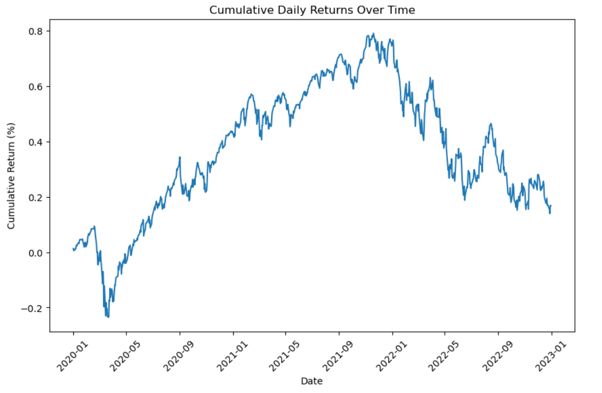

# Analyzing Nasdaq Historical Stock Price

## Project overview:
This project focuses on using Python to explore and analyze the historical prices of Nasdaq stock, with the goal of using visualizations to answer the following questions:

- How does the average daily price range vary across different months?
- How do daily percentage returns accumulate into monthly percentage returns?
- Is there a pattern in the correlation between the daily high-low price range and the daily percentage return?

The project code and results are contained in the Jupyter Notebook `analyze-NASDAQ-stock.ipynb`, with a summary of the conclusions below.

Note that nothing in this project is intended as financial advice.

## Data: 
The `datasets` directory contains the historical daily and monthly OHLC stock prices for Nasdaq:
- `NASDAQ_daily_prices.csv` contains the daily OHLC stock prices for Nasdaq (`NDAQ`) from 2020 to 2022
- `NASNAQ_monthly_prices.csv` contains the monthly OHLC stock prices for Netflix (`NDAQ`) from 2020 to 2022

## Conclusion:
1. **Average Daily Price Range Across Different Months:**
   The average daily price range shows significant variation from month to month. In certain periods, such as early 2020 and parts of 2022, the price range spiked significantly, indicating higher volatility during these times. Other months, particularly in mid-2021, saw a much smaller average price range, reflecting relatively stable market conditions. This variability could be tied to macroeconomic events or market-specific catalysts affecting the NASDAQ during these periods.

2. **Daily Percentage Returns Accumulating into Monthly Percentage Returns:**
   Daily percentage returns, when accumulated into monthly percentage returns, reveal how small day-to-day movements can combine into larger overall trends. The relationship between daily and monthly returns illustrates that a few volatile days within a month can have a significant impact on the overall monthly performance. This highlights how market volatility on individual days contributes to the broader monthly trends, emphasizing the importance of monitoring both short-term and long-term price movements.

3. **Correlation Between Daily High-Low Price Range and Daily Percentage Return:**
   There appears to be a weak but noticeable relationship between the daily high-low price range and the daily percentage return. Generally, days with larger price ranges tend to show higher volatility in returns, as the wider price movement allows for greater shifts in percentage change. However, this relationship is not perfectly linear, as there are many days with large price ranges but relatively moderate percentage returns, suggesting other factors like market sentiment or external events influencing the returns.

### Overall, the analysis suggests that:
- Market volatility varies significantly month to month.
- Daily returns, though small individually, can accumulate into significant monthly performance.
- There is a loose correlation between the price range and percentage return, with wider price ranges often (but not always) corresponding to more volatile returns. Understanding these relationships helps in better forecasting market movements and assessing risk over different time horizons.

  ## Example Visualization:

